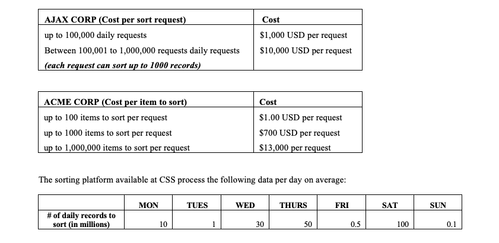

# Final Project

### PURPOSE

In this real-world assignment you will be evaluating solutions/alternatives that you may be required to perform when you work for companies such as TSYS, Aflac and/or IBM. As software engineers we usually are in charge to choose software products to fit needs, and this project will help you to think about different aspects to satisfy a company’s need. In addition, you will be applying concepts that we have covered in this class such as computational complexity, data structures, sorting, evaluating/comparing, performing experiments with software which are required skills not only in the industry but also in the upcoming classes. Finally, this assignment corresponds to 10% percent of your class. It may mean passing the class or getting an A.

### TASK

ACME Corporation and AJAX Inc. are important companies in the IT sector who have developed advanced sorting libraries to help other companies to facilitate the development of information systems. These solutions are implemented as Software as a Service (SaaS). As these methods are supposed to be executed in a SaaS architecture, each company has developed different pricing model to access and process data in their systems. ACME and AJAX have the following pricing model for their sorting products:



Your current manager at Columbus Software Solutions (CSS) has asked your development team to check which of the two solutions (ACME or AJAX) is better for CSS to buy or use to implement the new sorting platform at CSS (maybe a combination of both?). Both companies have instrumented carefully modified versions of their algorithms for CSS (as .jar libraries) to study and decide what to buy.

### Your manager has provided the following information about these libraries:

-  Each company has provided a .jar file with a carefully instrumented method that returns the number of instructions each sorting method executes. The methods are as follows:
    
##### ACMESorting.jar: 
This jar file contains a package called acmesorting that contains only once class called ACMESorting. The ACMESorting class has only one static method with the following signature:
    
```Java
public static int acmeSorting(int array[]) 
```

Given the array passed as parameter, this method sorts the array and returns the number of instructions that the method executed to sort the array.
    
##### AJAXSorting.jar: 
This jar file contains a package called ajaxsorting that contains only once class called AJAXSorting. The AJAXSorting class has only one static method with the following signature: 
    
```java
public static int AJAXSort(int array[]) 
``` 

Given the array passed as parameter, this method sorts the array and returns the number of instructions that the method executed to sort the array.


-  ACME Corporation claims that they have the best sorting algorithm in the market. They say the complexity of their algorithm is in the order of O(log2(n)). AJAX Inc. claims that they have a better sorting algorithm than ACME Corp. but they have not provided the complexity of their sorting algorithm since it may reveal trade secrets that they do not want ACME Corp. or any other corporation to know about.

### How CSS should implement their new sorting platform? 

**To answer this question think about the aspects of the SaaS solutions presented to you :**

1. Are they transparent about the running time of their algorithms? How can you design an experiment to corroborate who is telling the truth about the computational complexity of their solutions?

1. How do you know which pricing cost fits better given the workload to sort per day?

1. How would you implement a program to sort the volumes of data processed by CSS by using the products you have to evaluate? Think about the limitations on each of the presented SaaS solutions in terms of running times and cost to execute.


### CRITERIA

Your project will be evaluated based on (1) **your deliverables** (if you submit them or not) and (2) **the quality of your analysis**. Think that your instructor is the president of Columbus Software Solutions, and he/she will make a decision on how to invest the company’s money. 

**The deliverables of this project are as follows:**

1. A technical report explaining your analysis. The report must contain information about the analysis of the algorithms, the solution to implement to sort for CSS Corporation and an analysis of your proposed solution to CSS (in running time and monetary cost). Have a clear decision with justification on your proposed solution.

    > In addition, start your tech report explaining and including a description on software as a service (SaaS), examples/scenarios in which companies (both small and big) have successfully used this technology and drawbacks on using this type of technology.  You can find good examples on technical reports in these two websites: 
   >[here](https://www.cibse.org/membership/help-for-applicants/sample-reports-and-interview-guidance/technical-report-samples ) and
   >[here](https://www.nde-ed.org/GeneralResources/Report/TechReport.htm)

1. Any source code you use to conduct experiments to find out more about each of the SaaS solutions. You must experiment! There is no way to develop your report without experimenting with the algorithms. 

1. Your coding solution to perform the sorting per day (there are 7 days on which CSS perform sorting per day). For each of the days create a class called CSSSorting, and for each day create a method, something like:

    ```Java 
    public static void CSSSortMonday(int[] values)
    ``` 
    ```Java
   public static void CSSSortTuesday(int[] values) 
    ```   
    ```Java
   public static void CSSSortWednesday(int[] values)
    ```
    ```Java
   public static void CSSSortThursday(int[] values)
    ```
    ```Java
   public static void CSSSortFriday(int[] values)
    ```
    ```Java
   public static void CSSSortSaturday(int[] values)
    ```
    ```Java
   public static void CSSSortSunday(int[] values)
    ```

    In each of these methods implement how you think the sorting should take place based on the each of the offered solutions/libraries. 

1. A presentation recorded in a video and uploaded to YouTube about your project. You can create a power point presentation and record your presentation explaining your report to your manager. You can use the freely available software [OBSProject](https://obsproject.com/ ) to record your presentation and upload it to YouTube.  Also upload the presentation to the submission folder. 

