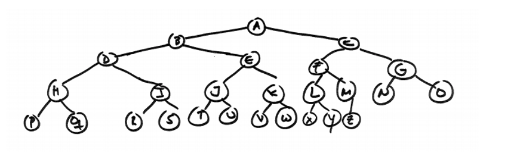

# Assignment 4

The goal of this assignment is to write a Java program that finds the lowest common ancestor of two nodes in a binary tree. To accomplish this goal, you will have to implement a program that allows the user to ask for two letters on the tree shown below, and **finds the lowest common ancestor of those two nodes in the tree**. 

> For example, the lowest common ancestor of letter I and letter P is letter D. The lowest common ancestor of letter D and letter Z is node A. The lowest common ancestor of letter X and letter O is node C.

###programming_assignment_4.TreeNode Class
it represents a node in a binary tree (and/or the subtree/tree from that treenode). Look that this class can store any type of object as long as it implements the Comparable interface. The programming_assignment_4.TreeNode class has three class fields: parent, left, and right which represent respectively the parent, left and right nodes in a binary tree. If you want to create the root node of a tree using this class, the parent should be setup to null. Given an object of the type that the programming_assignment_4.TreeNode stores, this class allows to find the programming_assignment_4.TreeNode where the object is stored (method findNodeOnTree).

### TreeExercise class
This class have two methods: main and findLowestCommonAncestor. You must provide your implementation of this method, which receives two programming_assignment_4.TreeNode objects that are stored in the same tree, and then find the lowest common ancestor of such nodes. 
The main method is incomplete. Your task here is to insert into a binary tree the strings on the myStringChars array. This array has the uppercase letters of the English alphabet from A to Z. Using the array representation we learnt, your first task is to create a binary tree using programming_assignment_4.TreeNode objects where the letters are stored in the tree. Then your program should ask for the two letters of the alphabet (distinct letters and in uppercase), search for the nodes that contain such letters in the tree, and then find the common ancestor. You must provide an implementation of the findLowestCommonAncestor method.

